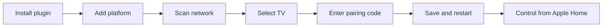
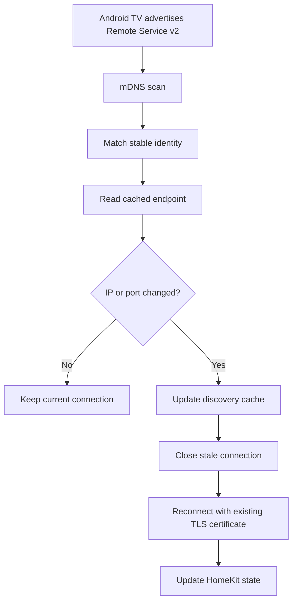

<h1 align="center">AndroidTV Ultimate</h1>

<p align="center">
  Local-first Android TV and Google TV control for Homebridge.<br>
  Remote Service v2 pairing, automatic discovery, accurate power state, and no cloud dependency.
</p>

<p align="center">
  <a href="https://www.npmjs.com/package/homebridge-androidtv-ultimate"></a>
  <a href="https://www.npmjs.com/package/homebridge-androidtv-ultimate"></a>
  <a href="https://github.com/tharunpkarun/homebridge-androidtv-ultimate/actions/workflows/ci.yml"></a>
  
  
  <a href="LICENSE"></a>
</p>

> [!NOTE]
> AndroidTV Ultimate communicates directly with Android's Remote Service v2. It does not require ADB, a cloud account, a vendor API, analytics, or telemetry.

| Start here | Learn more | Get help |
| :---: | :---: | :---: |
| [🚀 Quick start](#quick-start) | [✨ Capabilities](#capabilities) | [🧰 Troubleshooting](#troubleshooting) |
| [📦 Installation](#installation) | [📡 Discovery and IP recovery](#discovery-and-ip-recovery) | [🔐 Security](#security-and-privacy) |
| [📺 Pair a TV](#pairing) | [⚙️ Configuration](#configuration) | [🤝 Contribute](#development-and-contributing) |

## Why AndroidTV Ultimate?

An unreachable TV should not appear as **On**. Each configured device gets its own connection, credentials, state machine, and reconnect loop. The accessory becomes `On` only after its authenticated remote connection succeeds, and returns to `Off` after the configured disconnect grace period.

The plugin also follows DHCP changes automatically. It discovers the same device again, updates the cached IP address, and reconnects without changing its HomeKit identity or Android TV pairing credentials.

## Installation

### Homebridge UI

Search for `homebridge-androidtv-ultimate` in **Plugins**, install it, then add the **AndroidTV Ultimate** platform.

### npm

```bash
npm install -g homebridge-androidtv-ultimate
```

## Quick start



1. Put Homebridge and the Android TV device on the same local network.
2. Open the AndroidTV Ultimate settings dashboard.
3. Select **Scan Network**.
4. Choose a discovered device and select **Pair**.
5. Enter the six-character hexadecimal code displayed by the TV.
6. Save the configuration and restart Homebridge.

The paired device appears in Apple Home as a Television accessory. AndroidTV Ultimate uses cached platform accessories under the main bridge or its configured child bridge; it does not publish a separate external bridge for every TV.

## Capabilities

| Capability | Status | Notes |
| --- | :---: | --- |
| Remote Service v2 certificate pairing | ✅ | Completed through the Homebridge settings dashboard |
| Android TV / Google TV mDNS discovery | ✅ | Uses `_androidtvremote2._tcp.local` |
| Automatic DHCP/IP recovery | ✅ | Preserves HomeKit identity and pairing credentials |
| Accurate online/offline power state | ✅ | Offline never defaults to `On` |
| HomeKit Television and Speaker services | ✅ | Uses standard cached platform accessories |
| Directional, Select, Home, Back, media, and Info keys | ✅ | Sent through the local remote connection |
| Volume, mute, and absolute volume | 🟡 | Availability and feedback depend on firmware |
| App URI Input Sources | 🟡 | The target firmware must support the configured URI |
| Wake-on-LAN | 🟡 | Requires a network MAC and hardware network-standby support |
| Docker operation | ✅ | Host networking is recommended for multicast and broadcast traffic |
| Cloud APIs, analytics, or telemetry | ➖ | Not used |
| ADB, Fire TV, voice streaming, or Remote Service v1 | ➖ | Outside the current scope |

### HomeKit controls

Depending on firmware support, AndroidTV Ultimate exposes:

- Active power state
- Directional navigation and Select
- Home, Back, Exit, Menu, and Information
- Play/Pause and media navigation
- Volume up/down, absolute volume, and mute
- App URI launch through Television Input Sources

Every device remains isolated: a disconnected TV cannot overwrite another TV's state.

## Discovery and IP recovery

AndroidTV Ultimate refreshes Android TV mDNS advertisements every 60 seconds by default. It reads the service instance, hostname, TXT metadata, Remote Service port, IPv4 address, and IPv6 address.



Discovery data is stored at:

```text
<Homebridge storage>/androidtv-ultimate/discovery.json
```

Previously discovered devices remain cached while powered off. New devices appear in the pairing dashboard, but are not added to Apple Home until pairing succeeds.

### Device identity matching

The cache matches advertisements using the strongest available identity:

1. Existing device ID or saved alias
2. Network MAC address
3. Android TXT or hardware discovery ID
4. mDNS service name
5. mDNS hostname
6. Previous endpoint or a unique matching display name

The Android `bt` TXT value may be retained as a stable discovery identifier, but it is never treated as a Wake-on-LAN network MAC.

### IPv4 and IPv6

IPv4 is preferred when a device advertises both IPv4 and link-local IPv6 addresses. IPv6 remains available as a fallback when it is the only advertised address.

## Pairing

Remote Service v2 uses two local TLS endpoints:

| Purpose | Port | Authentication |
| --- | ---: | --- |
| Pairing | `6467/tcp` | On-screen six-character code |
| Remote control | `6466/tcp` | Mutual TLS client certificate |

Pairing creates an individual certificate and private key for each device. If a TV is factory-reset or revokes its client, select **Re-pair** in the dashboard.

### Credential storage

Credentials are kept outside `config.json` at:

```text
<Homebridge storage>/androidtv-ultimate/credentials.json
```

The file is written with owner-only permissions (`0600`). Certificates, private keys, and pairing codes are excluded from dashboard diagnostics.

## Power-state behavior

The initial device state is deliberately conservative:

```text
connection: offline
power: off
```

The accessory changes to `On` only after mutual TLS connects successfully. Following a disconnect, it changes to `Off` when `disconnectGraceMs` expires. The default grace period is `2500` milliseconds, which filters brief network interruptions without retaining a stale state indefinitely.

## Feature guides

### App Input Sources

Remote Service v2 can launch Android app links, but installed-app enumeration is not consistent across firmware. Configure Input Sources explicitly with a web or custom URI:

```json
{
  "name": "Video",
  "uri": "https://example.com/tv"
}
```

```json
{
  "name": "Streaming App",
  "uri": "example-app://"
}
```

Each configured entry appears as a HomeKit Television Input Source.

### Wake-on-LAN

When a TV is online, power commands use Remote Service v2. When it is offline, an `On` request sends a Wake-on-LAN packet only if `mac` is configured.

The HomeKit accessory remains `Off` until the authenticated remote connection returns. This prevents a magic packet from being reported as a successful wake prematurely.

Wake-on-LAN depends on hardware and firmware. Enable network standby, quick start, or the equivalent TV setting. Use the Ethernet/Wi-Fi network MAC—not a Bluetooth identifier.

### Docker and network requirements

Host networking is recommended because mDNS multicast and Wake-on-LAN broadcast traffic may not cross a bridged container network.

Required local traffic:

| Protocol | Destination | Purpose |
| --- | --- | --- |
| UDP | `224.0.0.251:5353` | mDNS discovery |
| TCP | `TV-address:6467` | Pairing |
| TCP | `TV-address:6466` | Remote control |
| UDP | Broadcast address, normally port `9` | Optional Wake-on-LAN |

Manual host configuration remains available when multicast cannot reach the container.

### Legacy migration

The dashboard can preview:

```text
<Homebridge storage>/androidtv-config.json
```

On common Docker installations this is `/var/lib/homebridge/androidtv-config.json`.

Migration imports recognized device settings and reusable Remote Service v2 certificate/key pairs. It deliberately excludes Apple Home usernames, setup PINs, bridge identities, and cached HomeKit accessories. The original file is not deleted.

## Configuration

The dashboard creates and maintains device identities automatically. The main options are:

| Option | Default | Description |
| --- | ---: | --- |
| `disconnectGraceMs` | `2500` | Delay before a disconnected device is reported as Off |
| `discoveryIntervalSeconds` | `60` | Interval for refreshing cached mDNS endpoints |
| `remotePort` | `6466` | Remote Service v2 control port |
| `pairingPort` | `6467` | Remote Service v2 pairing port |
| `mac` | — | Optional network MAC for identity matching and Wake-on-LAN |
| `broadcastAddress` | `255.255.255.255` | Wake-on-LAN broadcast destination |
| `deviceType` | `television` | HomeKit category: `television` or `settopbox` |

Fields such as `discoveryId`, `serviceName`, and `hostname` are maintained by discovery and should normally not be edited manually.

### Complete configuration example

```json
{
  "platform": "AndroidTVUltimate",
  "name": "AndroidTV Ultimate",
  "disconnectGraceMs": 2500,
  "discoveryIntervalSeconds": 60,
  "devices": [
    {
      "id": "stable-device-id",
      "name": "Living Room TV",
      "host": "192.168.1.40",
      "remotePort": 6466,
      "pairingPort": 6467,
      "deviceType": "television",
      "mac": "AA:BB:CC:DD:EE:FF",
      "broadcastAddress": "192.168.1.255",
      "inputs": []
    }
  ]
}
```

## Troubleshooting

### Scan Network finds no devices

1. Wake the TV and keep it on during the scan.
2. Confirm Homebridge and the TV are on the same VLAN or multicast-enabled network.
3. Allow UDP multicast traffic to `224.0.0.251:5353`.
4. For Docker, use host networking or add the host manually.
5. Confirm the firmware exposes `_androidtvremote2._tcp.local`.

**Expected result:** the dashboard lists the device with its current address, port, and last-seen time.

### Pairing does not start or the code fails

1. Confirm TCP port `6467` is reachable from the Homebridge host.
2. Keep the TV awake and leave the pairing code visible.
3. Enter exactly six hexadecimal characters.
4. Cancel the existing session before starting another attempt.
5. Use **Re-pair** if the TV previously revoked this client.

**Expected result:** credentials are saved and the dashboard reports the device as paired.

### A paired TV remains offline

1. Confirm TCP port `6466` is reachable.
2. Select **Scan Network** to refresh the endpoint cache immediately.
3. Compare the dashboard's last-discovered address and timestamp with the current network address.
4. Re-pair only if the TV was reset or its pairing clients were cleared.

**Expected result:** the cached endpoint updates and the existing certificate reconnects without creating a new HomeKit accessory.

### The TV is off but Apple Home shows On

1. Wait for `disconnectGraceMs` to expire.
2. Confirm the dashboard reports `offline`.
3. Lower `disconnectGraceMs` if faster offline reporting is preferred.
4. Confirm no older plugin controls the same Television accessory.

**Expected result:** the accessory reports `Off` after the remote connection is unavailable beyond the grace period.

### Wake-on-LAN does not work

1. Confirm `mac` is the Ethernet/Wi-Fi network MAC, not a Bluetooth identifier.
2. Enable network standby or quick start on the TV.
3. Configure the subnet broadcast address when global broadcast is blocked.
4. Confirm the Homebridge host or container can send UDP broadcasts.

**Expected result:** the TV wakes, reconnects over TLS, and only then changes to `On` in HomeKit.

> [!TIP]
> Generate diagnostics from the dashboard before opening an issue. Diagnostics include runtime, connection, and discovery status, but exclude pairing credentials.

## Security and privacy

- Control traffic remains on the local network.
- Each TV receives its own pairing identity.
- Credentials are stored outside `config.json` with owner-only permissions.
- Diagnostics exclude certificates and private keys.
- No cloud login, telemetry, analytics, or vendor API is used.

> [!WARNING]
> Never post pairing certificates, private keys, pairing codes, Homebridge backups, or unsanitized packet captures in a public issue.

## Supported scope

AndroidTV Ultimate targets Android TV and Google TV devices that expose Remote Service v2.

### Features outside the current scope

- Fire TV support
- ADB control
- Vendor cloud APIs
- Voice streaming
- Automatic installed-app enumeration
- Remote Service v1

## Development and contributing

Issues and pull requests are welcome. Read [CONTRIBUTING.md](CONTRIBUTING.md) and [SECURITY.md](SECURITY.md) before contributing.

### Development setup

```bash
git clone https://github.com/tharunpkarun/homebridge-androidtv-ultimate.git
cd homebridge-androidtv-ultimate
npm install
npm run check
npm run build
npm pack --dry-run
```

Tests cover protobuf framing, pairing and remote messages, state isolation, Wake-on-LAN, migration, mDNS filtering, persistent discovery, offline cache retention, and DHCP/IP changes.

When reporting protocol behavior, include the manufacturer, model, firmware version, and sanitized dashboard diagnostics.

## Author

<table>
  <tr>
    <td width="150" align="center" valign="top">
      <a href="https://www.tharunpkarun.com">
        
      </a>
      <br>
      <a href="https://github.com/tharunpkarun"><code>@tharunpkarun</code></a>
    </td>
    <td valign="top">
      <h3>Tharun P Karun</h3>
      <p><strong>Founding Engineer &amp; AI Architect · Engineering Leader · Systems Builder</strong></p>
      <p>
        I build AI-first products and scalable, human-centered systems. My work spans engineering leadership,
        system architecture, and career-tech platforms adopted by more than one million users.
      </p>
      <p>Team Lead at Lifology · Kerala, India</p>
    </td>
  </tr>
</table>

<p align="center">
  <a href="https://www.tharunpkarun.com"></a>
  <a href="https://github.com/tharunpkarun"></a>
  <a href="https://linkedin.com/in/tharunpkarun"></a>
</p>

| Discover more | Read and explore | Connect |
| :---: | :---: | :---: |
| [About me](https://www.tharunpkarun.com/about) | [Blog](https://www.tharunpkarun.com/blog) | [Contact](https://www.tharunpkarun.com/contact) |
| [Projects](https://www.tharunpkarun.com/projects) | [Home Lab](https://www.tharunpkarun.com/homelab) | [X / Twitter](https://twitter.com/tharunpkarun) |

<p align="center">
  
  
  
  
</p>

## License

This project is available under the [MIT License](LICENSE). © 2026 Tharun P Karun.

<p align="center">
  <a href="https://www.npmjs.com/package/homebridge-androidtv-ultimate">npm</a> ·
  <a href="https://github.com/tharunpkarun/homebridge-androidtv-ultimate/issues">Issues</a> ·
  <a href="https://github.com/tharunpkarun/homebridge-androidtv-ultimate/pulls">Pull requests</a>
</p>
